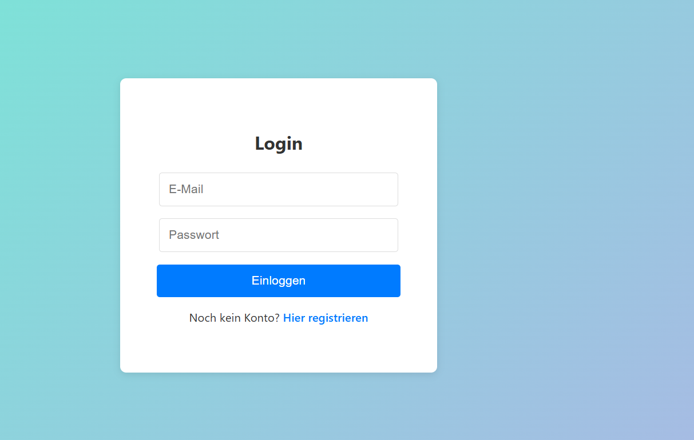
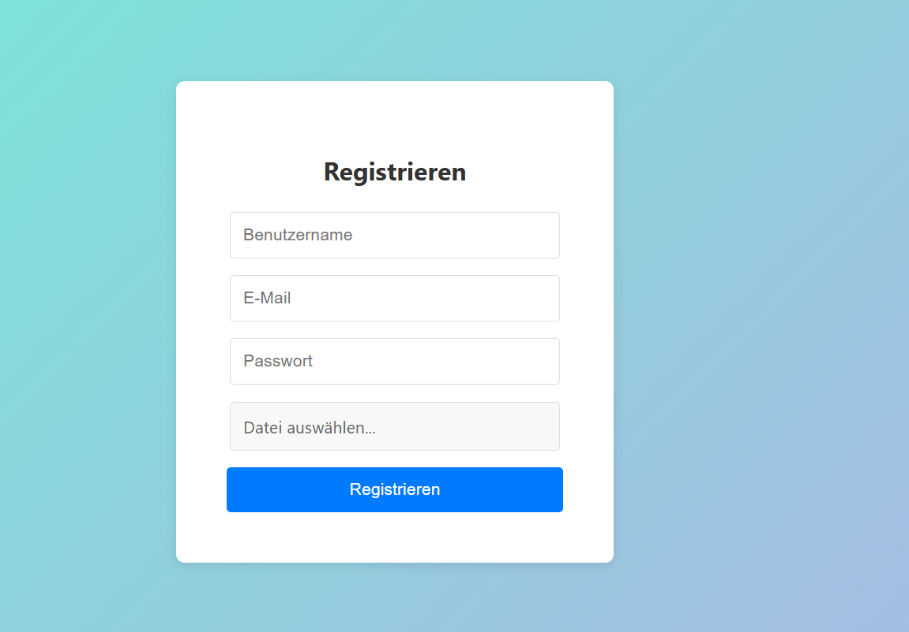

# 💬 Meine Chat-App

Eine einfache **Chat-Anwendung** mit **Login**, **Registrierung**, **Profilbild-Upload** und **Echtzeit-Nachrichtenübertragung** zwischen Benutzern.

---

### 🔐 Login-Seite



### 📝 Registrierung



## 🚀 Funktionen

- 🔐 Benutzerregistrierung mit E-Mail, Passwort und Profilbild
- 🔑 Login/Logout-System
- 💬 Echtzeit-Chat mit Socket.io
- 🧑‍🤝‍🧑 Benutzerliste mit Online-/Offline-Status
- 📅 Integrierte Agenda (Kalenderübersicht)
- 🎨 Modernes UI mit React + TailwindCSS

---

## 🏗️ Technologien

### Frontend
- React.js
- Axios
- Socket.io-client
- TailwindCSS

### Backend
- Node.js + Express
- MongoDB (Mongoose)
- Socket.io
- JWT (für Authentifizierung)

---

## ⚙️ Installation

### 1️⃣ Backend starten
```bash
cd backend
npm install
npm start
